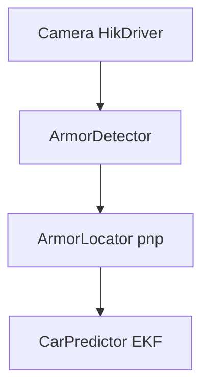

# ARTINX2025赛季 Project 

[TOC]

## 1.项目概述

在本次作业中，你需要设计并且完成一个装甲板的识别（已经在assignment3中完成，如果你们真的完成了的话qwq），定位和运动学预测解算的系统建模，并且通过相机标定对于实际平动机器人进行实际的效果检验。

各个任务的队内代码实现版本可以在[Gitlab](https://mirrors.sustech.edu.cn/git/ARTINX/artinx-hub)中找到。请注意实现的具体内容可能与本次proj有区别。

**队内代码严禁上传至其他公共仓库。**

**装甲板识别**可以根据Assignment3 中实现的简易的装甲板识别器来实现。 

装甲板模型的**定位**和**运动学解算**参考坐标系解算内容和卡尔曼滤波的实现。

大致流程：



在此流程中，第一个节点为相机驱动，第二个节点为装甲板的识别，此两节点在assignment3已经做过详述，在此不再赘述，本文档将给出装甲板运动学解算和装甲板运动预测的实现思路，和必备相关知识。

## 2.相机标定(Camera HikDriver)

### Ref: src/PreProcess/Undistort.cpp


标定的具体原理参考`lecture9` 的具体内容，这里对于`project` 中的相关重点概念和操作进行简述。
**相机标定的目标**：相机将三维的信息压缩到二维平面，在机器视觉中为了实现三维重建，通过相机获取的图片获取三维世界的信息我们需要一套参数（内参，外参，畸变系数），以确定空间物体表面某点的三维几何位置与其在图像中对应点之间的相互关系。

**获取值**： 相机标定可以获取相机的**内参信息**（焦距，主点坐标，像素尺寸，偏斜系数等）和畸变信息（径向和切向）。而**相机外参**描述的是世界坐标系到相机坐标系的转换关系。（平移+旋转），外参值可以通过pnp解算得到，在此我们不再展开。

在此任务中可视为世界坐标系和相机坐标系重合——所以我们不需要理会外参。
所以我们只需标定内参和畸变系数。

**提供信息**：

具体通过工业相机，海康相机来获取图像信息。工业相机能够提供区别于一般相机的高分辨率，强的耐用性和稳定性以及高速的图像信息采集，适合RM 比赛的视觉需求。

本次`project` 中会提供海康相机的**相关标定程序**以及**海康相机的相机驱动**，以来完成相机标定

相机驱动的安装可以参考 `artinx-hub` 中`readme` 中相机驱动的安装部分。

具体安装 从nas 中下载合适的 Hik Robot 驱动 [hik robotics](https://www.hikrobotics.com/cn/machinevision/service/download?module=0)。 

设置环境变量`HIK_SDK=/opt/MVS` 到 `/etc/profile` 中：

```bash
sudo vim /etc/profile                           #打开/etc/profile文件

#在文件末尾加入以后命令
export HIK_SDK=/opt/MVS                         #默认安装到此位置，不一样的自己改
```

## 3. 装甲板识别(Armor_detector)

### Ref: src/Detector/ArmorDetector.cpp

**装甲板识别**可以根据Assignment3 中实现的简易的装甲板识别器来编写。

## 4. 装甲板定位(Armor_locator)

### Ref: src/Solve/ArmorLocator.cpp

装甲板的信息处理可以通过pnp 实现，通常我们至少需要3个点（非共线）来解决pnp问题。

但是在此情境下，我们考虑使用4个点来解决此问题——没错就是assgnment3中获得的4个角点

OpenCV 中的 solvePnP API 已经在`lecture9` 中给出，可以直接调用，如果对于使用或是相关拓展存疑，可以去看官方文档。

```cpp
bool cv::solvePnP(
    const std::vector<cv::Point3f>& objectPoints,
    const std::vector<cv::Point2f>& imagePoints,
    const cv::Mat& cameraMatrix,
    const cv::Mat& distCoeffs,
    cv::Mat& rvec,
    cv::Mat& tvec,
    bool useExtrinsicGuess = false,
    int flags = cv::SOLVEPNP_ITERATIVE
);
```

**思路：**

我们如果假设装甲板的中点为世界坐标系原点，那门我们就可以知道**世界坐标系中装甲板四个角点的三维坐标**，同时我们已知四个角点在图像坐标系中的坐标，那么我们就可以使用pnp算法求解相机在**世界坐标系**中的位置和方向。

我们进行逆变换就可以获得在相机坐标系下装甲板的三维信息。

由此可以得到**世界坐标系**相对于相机坐标系的 平移向量(tvec) 和 旋转向量(rvec)。 用于描述两个坐标系的信息变换，此时的世界坐标系也可以成为装甲板坐标系。

## 5. 运动学建模(CarPredictor)

### Ref: src/PostProcess/CarPredictor.cpp

运动学建模基于卡尔曼滤波相关知识，具体参考`lecture9` 中的拓展卡尔曼滤波的实现部分。

卡尔曼滤波进行运动状态的估计，可以理解为将观测量（相机看到的）与预测量（根据运动模型计算得到）的装甲板未来的姿态做加权平均得到装甲板未来的"实际"位姿。

**思路**

可以通过装甲板 armor 的pnp 解算的结果作为拓展卡尔曼滤波中**观测量**， 车辆几何中心的相关信息量作为运动建模的**观测量** 。

- 观测量处理：对于装甲板pnp 得到的结果，**平移向量（tvec）** 实际代表了装甲板相对相机坐标系的**坐标位置**， 具体姿态信息(比如说**yaw**角度)可以通过 **旋转向量（rvec） 求解**。

  关于具体角度如何求解，可以参考`cv::Rodrigues` 函数来计算变换阵后，根据旋转轴的先后顺序，反向得到对应的角度的角度值。

- 状态量处理: 可以思考装甲板几何中心到车辆几何中心的 坐标关系，建立观测量和状态量之间的关系。

**提示**

可以选择的观测量：装甲板几何中心相对于相机坐标系的位置量 $x_a,y_a,z_a$ 和 $yaw$

可以选择的状态量：车辆的几何中心相对于相机坐标系的位置量 $x_c,y_c,z_c $ 和 $yaw$ 

​                                   车辆的几何中心相对于相机坐标系的速度量 $v_{xc},v_{yc},v_{zc} $ 和 $v_{yaw}$

​                                   车辆的半径 $r$

由此可以完成基于拓展卡尔曼滤波的运动学建模的状态预测和更新。

## 7. 验收指标

请自行完成海康相机的标定，通过标定的相机去实现`project`。

作业的结果中请给出相机录制的视频，在视频中绘制平移的车辆的**识别的装甲板中心**（用圆表示） 和 **预测的速度**（以箭头表示）。

提供一个文档，描述代码各个过程，并附上关键类代码。


## 8.作业提交

- 将代码打包成一个 zip 文件，文件名格式为：`姓名-学号-Project.zip`。
- 将文件发送至邮箱：`submit@vollate.top`，邮件标题为：`ARTINX2025视觉Project`
- 截止日期：2024年12月6日23:59