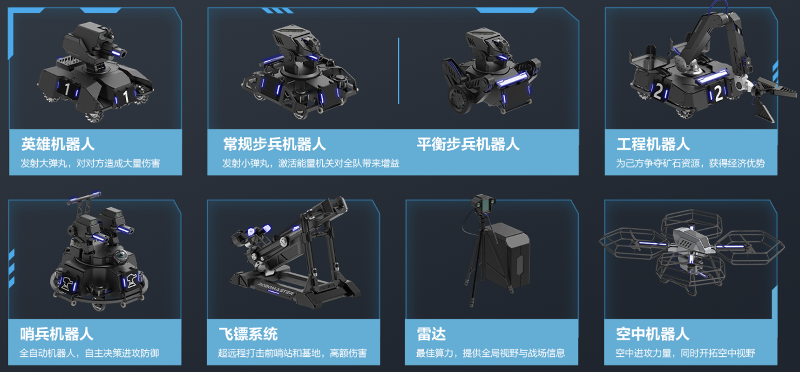
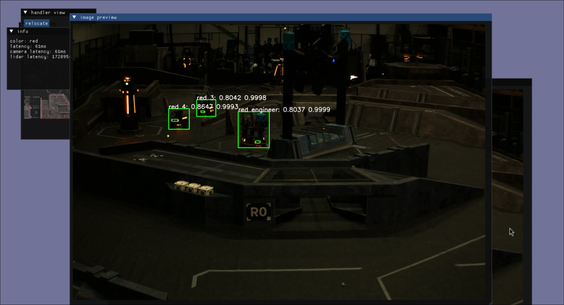
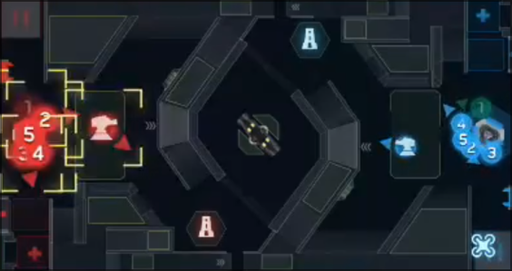

# Lecture 1

## 主讲人: 黄梓通

---
level: 1
---

## 目录

<Toc minDepth="2" maxDepth="4"></Toc>


---
layout: cover
background: img/field.png
---

# RoboMaster赛事介绍
---
layout: default
---

**RoboMaster赛事介绍**

RoboMaster 机甲大师超级对抗赛（RMUC, RoboMaster University Championship），侧重考察参赛队员对理工学科的综合应用与工程实践能力，充分融合了“机器视觉”、“嵌入式系统设计”、“机械控制”、“自主导航”、“人机交互”等众多机器人相关技术学科，同时创新性的将电竞呈现方式与机器人竞技相结合，使机器人对抗更加直观

**规则介绍**

在2024赛季中，对战双方需自主研发不同种类和功能的机器人，在指定的比赛场地内进行战术对抗，通过操控机器人发射弹丸攻击对方机器人和基地。比赛结束时，基地剩余血量高的一方获得比赛胜利。
<div align="center">

</div>


--- 
layout: iframe
url: https://www.bilibili.com/video/BV1ai421X7U6?p=57&vd_source=8230816b827a6144796db49afdcbacaa
--- 

**比赛回放：上海交通大学 vs 广东工业大学**

---
layout: cover
---

# 视觉/算法组工作内容

--- 
layout: default
---

**自动瞄准系统**

<video width="600" controls>
  <source src="./Video/auto_aim.mp4" type="video/mp4">
  Your browser does not support the video tag.
</video>

--- 
layout: default
--- 

**能量机关激活**

<video width="800" controls>
  <source src="./Video/buff_active.mp4" type="video/mp4">
  Your browser does not support the video tag.
</video>

--- 
layout: two-cols
--- 

**雷达站**
<br><br><br>



**机器人识别**

::right::

<br><br><br>



**操作手UI**

--- 
layout: default
--- 

**导航系统**

---
layout: two-cols-header
---

# 培训安排
视觉/算法组培训安排

视觉/算法组培训为课程+项目的制度，从9月持续到11月，共计八周。课程安排为每周两天，每天1-2小时课程时间，加上每周3-5h的作业量。

前4周以授课+课后作业的形式为主，后4周以预研项目为主。

::left::
## Part 1 课程
1. linux/git 简介，环境配置（1周）
2. C/C++ 基础（2周）
3. 视觉/导航算法基础（1周）
4. 代码讲解（1周）
<br><br>

::right::
## Part 2 预研项目
- [2025赛季预研项目](https://heavy-trampoline-037.notion.site/679f70dcd4234c41bc805b2eee3b41eb?pvs=4)

---
layout: cover
---

# Lecture 1: Intro to Computer (1)
--- 
layout: default
---

# TODO

--- 
layout: cover
---

# Lecture 2: C/C++ (1)

---
layout: two-cols-header
---

## WSL 的安装与使用

### 什么是 WSL

Windows Subsystem for Linux (WSL) 是一个能够在 Windows 上运行原生 Linux，安装简便。我们使用它来进行教学，可以在不使用双系统或虚拟机的情况下，以较好的性能运行一个 Linux 环境。


- [安装教程](https://docs.microsoft.com/zh-cn/windows/wsl/install)

安装好 WSL2 后，我们可以在 Microsoft Store 中安装 Ubuntu 22.04 LTS。

> 如果有喜欢的其他发行版（如 Arch，Debian 等），可以根据自己的喜好进行选择并自行配置开发环境。开发环境的配置我们会以 Ubuntu 22.04 LTS 为例进行讲解。

::right::

安装好后，先配置用户名和密码


<br/>

> **注意**：密码不会显示在屏幕上，输入时不会有任何反馈。

---

### Ubuntu 22.04 LTS 开发环境配置

在 Linux 中，我们常使用包管理器来安装软件，Ubuntu 中的包管理器是 `apt`，我们可以使用 `apt` 来安装软件。执行下面的命令来更新软件源并安装开发环境。

```bash {*}{lines: true}
sudo sed -i 's@//.*archive.ubuntu.com@//mirrors.ustc.edu.cn@g' /etc/apt/sources.list # 更换软件源为 USTC 镜像
sudo sed -i 's/http:/https:/g' /etc/apt/sources.list # 使用 HTTPS 协议，防止运营商缓存劫持
sudo apt update # 更新软件源
sudo apt upgrade # 升级已安装的软件
sudo apt install build-essential cmake git # 安装基本的开发工具
```

---

## 开始一个简单的 C++ 程序

<<< @/code/helloworld.cpp {*}{lines: true}

---


---

## Git: 分布式版本控制系统
