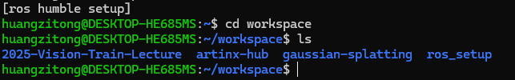
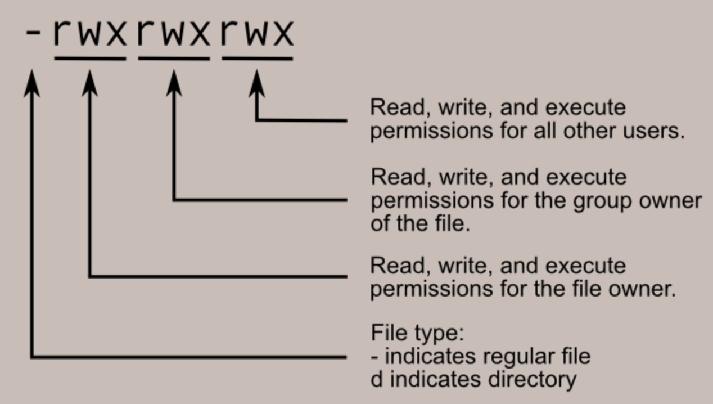
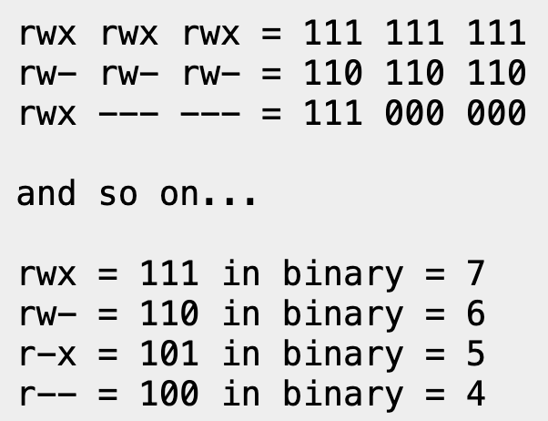

# Lecture 1: Introduction

---
layout: default
--- 

**目录**

<Toc minDepth="1" maxDepth="1"></Toc>

---
layout: cover
---

# Basis of Computer


---
layout: two-cols
--- 

## 计算机的组成


**CPU(中央处理器)**

电脑的中心计算单元，负责执行程序的指令。

**寄存器**

计算机的临时储存器，cpu能够直接访问。相比起内存容量更小，速度更快

**内存**

计算机的临时存储器，存储正在运行的程序和数据。cpu通过寄存器访问内存。。

::right::

<br><br>

**硬盘**

计算机的永久存储器，存储操作系统和用户数据文件。

**操作系统**

管理计算机硬件和软件资源的系统软件。

操作系统**不等同于**图形界面， 二者是两个不同的概念。

**GPU(图形处理器)**

负责输出图形的显示。由于计算显示内容的计算经常和矩阵运算有关，因此图形处理器也被用来进行一些ai相关的计算。


---
layout: cover
---

# Linux && Linux Distributions

--- 
layout: default
---

## 操作系统（operating system）是什么?
<br></br>

- 管理，协调与调用计算机的各个设备（如内存，硬盘，输入设备等）。

- 规划处理器的使用，为电脑的每个**进程**分配CPU资源。
> **进程**: 正在运行中的程序。一般来说，一个CPU核心**只能同时**运行一个进程。超出核心数的程序靠操作系统的进程调度算法**伪装**成同时进行。

<br></br>
- 提供**用户接口**（或者说，提供一种**相对不那么麻烦**的计算机操作方式）。

--- 
layout: default
---

## Linux与Linux发行版

- Linux，通常指Linux内核，仅包含硬件管理、进程调度、内存管理、文件系统和网络通信等底层功能，而不包含GUI，桌面环境，用户界面与常用程序（命令行等）。Linux内核一般来说**无法**被用户直接使用。
- 包含上述内容，与用户直接交互的操作系统，一般指基于Linux内核的**Linux发行版**。

## Ubuntu

目前为止最常用的Linux发行版，稳定，社区生态丰富。队内小电脑的使用的是Ubuntu22.04。

> **为什么使用Linux?**
> - 强大的包管理器机制。常见的Linux发行版都拥有至少一个包管理器。在windows上需要花一整节lab课和一大坨助教头发才能配成的环境，在Linux下可能只需要一行命令。
> - 与windows相比相对较高的稳定性。这里的稳定性并不是指出现故障的概率小，而是相比闭源（代码不公开）的windows来说，开源的Linux对于更可能会有解决方案。
> - 简介的系统环境。windows为了操作的简便性添加了非常多的额外设计，导致计算机需要消耗很多额外的资源运行操作系统。使用linux则能够更大程度地利用电脑的性能。

---
layout: default
---

## 如何安装?

常见的安装方式有三种

> - WSL（Windows Subsystem for Linux）. WSL是微软为linux开发者提供的一套兼容层（对于初学者来说，可以理解为一个为linux特制的虚拟机），安装简便，运行快速。缺点是对于图形界面的支持不算友好，且容易出现一些奇怪的bug。
> 
> - 在虚拟机中安装。相较wsl来说，虚拟机对于图形化界面的支持比较友好，且能够获得比较完整的使用体验。但相应的，安装稍微繁琐一些，且性能损失较大，以及同样会出现bug的问题。
> 
> - 在硬盘中直接安装ubuntu。通过给硬盘分区或加装硬盘，ubuntu能够与windows同时存在（虽然同一时间只能使用一个系统）。直接安装ubuntu能避免许多虚拟机/wsl中会出现的问题，但相对来说步骤比较繁琐，且会有**丢失硬盘中所有数据**的风险。尽管如此，我们鼓励所有想要加入队伍的人或者想要加入计算机系的人尝试这种方式，并且，我们会尽最大努力提供帮助。使用原生ubuntu22.04的同学在面试时将会作为额外加分项。

**考虑wsl安装比较简便，安装教学将以wsl为例**

---
layout: two-cols-header
---

## WSL 与 Ubuntu

### 什么是 WSL

Windows Subsystem for Linux (WSL) 是一个能够在 Windows 上运行原生 Linux，安装简便。我们使用它来进行教学，可以在不使用双系统或虚拟机的情况下，以较好的性能运行一个 Linux 环境。

<!--  -->

- [安装教程](https://docs.microsoft.com/zh-cn/windows/wsl/install)

<br/>

> 如果有喜欢的其他发行版（如 Arch，Debian 等），可以根据自己的喜好进行选择并自行配置开发环境。开发环境的配置我们会以 Ubuntu 22.04 LTS 为例进行讲解。

::left::


::right::
<br>
<br>
<br>

> 安装好后，先配置用户名和密码 <br> **注意**：密码不会显示在屏幕上，输入时不会有任何反馈。

---
layout: two-cols-header
---

## Shell(Terminal)
&nbsp;

- 一种通过命令与计算机交互的方式。相比起图形化界面，shell更加高效，且能够进行更多的操作。


::left::

**Shell 命令的基本格式**


> ```
> cp     ~/test.txt   ~/test/test.txt
> <指令>   <参数1>         <参数2>       ...
> ```
效果为将路径为~/test.txt的文件复制到~/test/test.txt


> 指令与参数，参数与参数使用空格隔开。若参数需要有空格，请使用"\ "代替" "

::right::

> 对于任何**想要加入视觉组**或者**想要进入计算机系**的同学，linux shell是**必须**熟练使用的东西，而这些在课堂上通常**不会**详细讲解。

**可能有用的资源**：

> [计算机缺失的一课](https://www.bilibili.com/video/BV1vt4y1R71v/?spm_id_from=333.337.search-card.all.click&vd_source=7abedfec08d3d35085e7c92173b424df)

> [Shell Tutorial](https://linuxcommand.org/lc3_lts0010.php)

---
layout: cover
---

# Learning Shell

[Shell Tutorial](https://linuxcommand.org/lc3_lts0010.php) is **strongly recommanded**.

--- 
layout: image-right
image: ./img/shell_path.png
---

## 文件路径(Path)

一般来说。linux的文件系统以树状结构组织，根目录为`/`。文件路径可以分为绝对路径与相对路径。

> - **绝对路径**：从根目录开始的路径，如 `/home/user/file.txt`。
> - **相对路径**：相对于当前目录的路径，如 `./file.txt`。

一般来说，用户的文件目录位于`/home/<username>/`.

<br></br>

`pwd`: 显示当前的工作路径

`cd <path>`: 切换当前工作路径到指定路径

`ls`: 显示当前工作目录下的所有文件/文件夹


--- 
layout: image-right
image: ./img/file_process.png
--- 

## 文件操作

常用的文件操作包括创建，移动，复制，删除与新建文件夹
- `touch`: 创建一个空白文件
> 在linux中，文件拓展名没有任何特殊含义。名字为image.jpg的文件完全可能是一个文本文件。
- `mv`：移动一个文件或文件夹。
> 可以通过mv <old_name> <new_name>实现文件的重命名。
- `cp`: 复制一个文件。
- `rm`: 删除一个文件。
> `cp`与`rm`无法直接对文件夹执行。需要对文件夹执行类似操作，请加上`-r`参数。
- `mkdir`：创建一个文件夹。

---
layout: two-cols-header
---

## 文件权限

- 在linux中，用户一般只能修改自己的文件。
- 当需要修改其他用户的文件时，需要转为root用户执行操作或使用`sudo`命令。
> 当用户拥有sudoer权限时，可以通过sudo命令执行需要root权限的操作。可以通过某些命令赋予用户sudoer权限。

- 文件权限分为三类：读，写，执行。一个文件的权限一般用3 * 3 = 9个二进制数表示，分别代表**文件所有者**，**文件所在组**，**其他用户**的权限。

> 举例：一个文件的权限值为777，转为二进制则为111_111_111, 代表文件所有者，文件所在组，其他用户的权限均为可读，可写，可执行

::left::



::right::



---
layout: image-right
image: ./img/permission_3.png
---

## 文件权限(2)

与权限相关的指令有

- `sudo`: super user do, 以超级用户的身份执行某条命令。
- `chmod`: 修改某个文件的权限。
- `su`: 转为root用户。


---

### Ubuntu 22.04 LTS 配置C++开发环境

在 Linux 中，我们常使用包管理器来安装软件，Ubuntu 中的包管理器是 `apt`，可以使用 `apt` 命令来安装软件。apt默认从国外软件源获取软件进行安装（由于某些原因，大概率连不上），因此需要将软件源更换至国内的软件源镜像。

```bash {*}{lines: true}
sudo sed -i 's@//.*archive.ubuntu.com@//mirrors.ustc.edu.cn@g' /etc/apt/sources.list # 更换软件源为 USTC 镜像
sudo sed -i 's/http:/https:/g' /etc/apt/sources.list # 使用 HTTPS 协议，防止运营商缓存劫持
sudo apt update # 更新软件源
sudo apt upgrade # 升级已安装的软件
sudo apt install build-essential cmake git openssh-server # 安装基本的开发工具
```

<br></br>

> 有关这些命令的含义，请自行使用搜索引擎进行查找。

---
layout: image-right
image: ./img/ssh.png
---

## SSH 远程访问

常用的SSH命令包括连接、断开、文件传输与密钥管理：
- `ssh`: 建立与远程服务器的连接
> 在使用ssh时，可以通过`ssh user@hostname`的方式指定登录的用户名和主机。
- `exit`: 断开当前的SSH连接
> 输入exit后，立即结束当前会话。
- `scp`: 通过SSH传输文件。
> 使用格式为`scp local_file user@hostname:remote_file`，可以从本地复制文件到远端服务器。

---
layout: cover
---

# Git 入门

--- 
layout: two-cols-header
---

# Git 简介

### 版本控制

> 初版 -> 修订版 -> 再修订版 -> 最后一次修订版 -> 最最后一次修订版...

Git 能够很好地追踪并储存项目中每个文件的修改历史，保证随时的回溯。

<br></br>

### 团队协作

> 这里改过，这里也改过，还有那里，还有这儿，这儿...
>
> ...
>
> 这儿也改了，不好意思刚没看见

Git 能够记录所有成员对项目的每一次改动，方便随时可能发生的代码合并。

---
layout: image-right
image: ./img/git.png
---

## 常用Git命令
常用的Git命令包括克隆，提交，拉取，推送与加入暂存区。
- `git clone <url>` : 从github上克隆项目
- `git push`: 将本地的修改同步到远程
- `git pull`: 将远程的修改同步到本地
- `git add <file_path>`: 将某个文件的修改加入暂存区
- `git commit -m <message>`: 将暂存区中所有修改的文件保存为一次提交(commit)

---
layout: default
---

## 提交规范

良好的提交信息能极大程度优化团队合作的效率，改善自己与同事的体验。

- [Angular规范](https://zj-git-guide.readthedocs.io/zh-cn/latest/message/Angular%E6%8F%90%E4%BA%A4%E4%BF%A1%E6%81%AF%E8%A7%84%E8%8C%83/)

- 提交信息清晰。提交格式: `<类型>(<作用域>): <信息>`， 例如feature(main.cpp): add one line to print "Hello World".
- 保证每个提交只完成一项功能
- ...


--- 
layout: cover
---

# 编程语言如何在计算机上运行？

---
layout: image-right
image: ./img/binary.png
--- 

<br></br>
## 可执行文件(机器码)

- 能够被计算机直接执行的文件

- 计算机**能且只能** "看得懂" 二进制串

- 本质上是一串一串的 0 和 1.

---
layout: image-right
image: ./img/assemble_demo.png
---

## 指令集 与 汇编语言

**指令**

- 计算机能直接执行的，具有特定含义的指令，例如寄存器拷贝，将内存。指令可以直接转换成二进制串。

**指令集**

- 计算机能够识别的所有指令的集合。不同架构的计算机（x86, arm, RISC-V, etc.）指令集不同，能直接执行的指令也不同。

**汇编语言**

- 一种由指令组成的低级语言。如右图。

---
layout: default
---

### 高级编程语言
- java, c, c++, python...
- 更容易编写与阅读，但需要一些手段处理成机器码
- example
```
int main{
    int a = 0;
    int b = 1;
    int c = a + b + 1;
    return 0;
}
```
在arm架构下，上面的代码转为汇编语言的样子是

```
main:
    mov r3, #0               // 将整数a初始化为0
    mov r4, #1               // 将整数b初始化为1
    add r5, r3, r4           // c = a + b
    add r5, r5, #1           // c = c + 1
    mov r0, #0               // 设置返回值为0
    bx lr                    // 返回

```


---
layout: default
---

## 从 C++代码 到 可执行文件

**预处理**
- 宏定义与展开, 头文件的展开（在后续的C++课程中，你会了解到宏与头文件的概念）

**编译**
- 高级语言 &rarr; 汇编语言
- 由编译器进行

**链接**
- 合并相同文件与不同文件中相关的代码，生成可执行文件

---
layout: default
---

## Hello, World!

一个简单的 C++ 程序

<<< @/code/helloworld.cpp {*}{lines: true}

编译运行：

```bash
g++ hello_world.cpp -o hello_world
./hello_world
```

