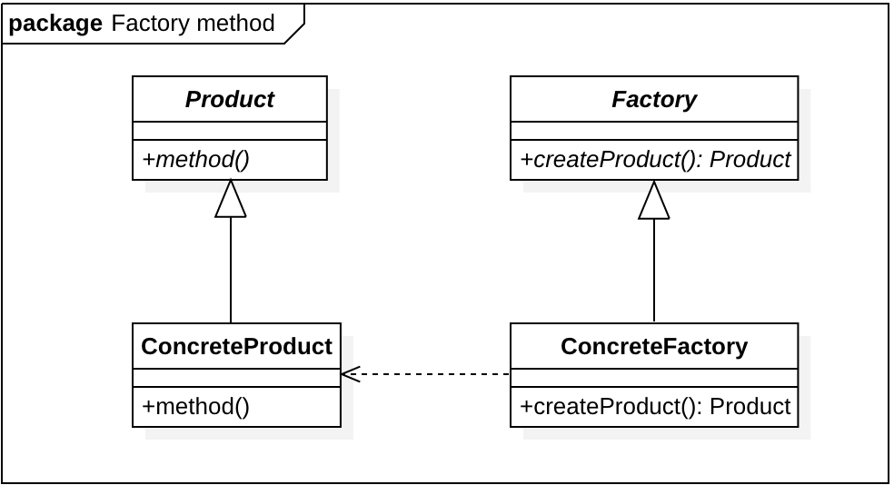

# Lecture 10
BanGVision! It's MyCode!!!!!

---
layout: cover
---

# 代码框架讲解
（1）CAF 框架讲解
（2）仓库结构
（3）如何看懂一个ACTOR
（4）如何新开始一个项目
---
layout: two-cols
---

## 1.CAF框架讲解
### 1.1 Actor 模型以及CAF 框架
Actor 模型是一种并发计算模型，其中每个 Actor 都是一个计算单元，能够执行以下操作：

发送消息：Actor 之间通过消息进行通信,异步发送的。\
接收消息：Actor 拥有一个消息队列，用于存储接收的消息。\
创建子 Actor: 可以动态创建其他子 Actor，管理其生命周期。

每个 Actor 拥有独立的状态，而不同 Actor 之间无法直接访问状态，这种模型极大地减少了多线程编程中常见的数据竞争问题。

CAF 框架基于 Actor 模型设计,可以通过 Actor System 来管理 Actor 的生命周期、消息传递和调度等功能，允许创建、管理和销毁 Actor。
::right::
### 1.2 工厂模式
工厂模式是一种创建型设计模式，主要用于封装对象的创建逻辑。

它通过定义一个接口或抽象类，允许子类决定实例化的具体类型，从而实现对象的创建和管理。

工厂模式的核心思想是将对象的创建与使用分离。



---
layout: two-cols
---
## 1.CAF框架讲解

### 1.3 守护进程（Daemon）: 

(/src/Daemon.cpp)

Daemon 仅在主进程中创建的 Actor 中守护，保证 Actor 的生命周期与主进程一致，适用于需要持续运行的服务进程。

Daemon 是主进程内的一个特殊 Actor，它会在主进程退出时自动停止。
它通过主线程的事件循环来保持活跃，并避免了孤立 Actor 在主进程关闭后继续运行的风险。

长期运行的后台服务：如日志收集器、资源监控器。

必须依赖主进程生命周期的功能模块：如数据库连接池管理器。
::right::
### 1.4 程序工作流程 
(/include/Hub.hpp src/HubMain.cpp deploy_config)

- CAF框架读取caf-application.conf初始化并进入caf_main
- caf_main根据argv[1]读取conf文件并解析
- 根据配置文件通过工厂模式初始化各actor，并将actor的地址收集到map里用于通讯
- actor初始化完毕，main广播start_atom
- 主进程睡眠，等待terminateSystem被调用（仅测试结束时被调用）或因为异常退出
---
layout: two-cols
---
## 2.仓库结构
### 2.1 outline
```shell
.
|-- bringup_templates 自启动/自动部署脚本
|-- config_templates actor使用示例
|-- data 数据
    |-- camera_calibration 相机标定结果
    |-- weights 神经网络/SVM 权重文件
|-- deploy_config 机器人部署配置
|-- docs 次级文档
|-- include 头文件
|-- pages 可视化网页文件
|-- scripts 脚本
|-- src 源代码
|-- tests 单元测试文件
|-- .clang-format C/C++格式化配置文件
|-- .clang-tidy linter config
|-- .gitattributes
|-- .gitignore
|-- .gitlab-ci.yml GitLab CI配置文件
|-- CMakeLists.txt CMake根目录配置文件
|-- CMakeSettings.json Visual Studio 2019 CMake配置文件
|-- Folder.DotSettings Resharper++ Lint配置文件
|-- README.md 本文件
```
::right::
### 2.2 some about CMakeLists.txt
(1) src

(2) root 
---
layout: two-cols
---

## 3.如何看懂一个ACTOR
(ArmorDetector.cpp为例)
### 3.1 Actor 信息发送
在 CAF 中，消息传递是通过 sendAll 函数来实现异步传递以及高效并发。
sendAll 的第一个参数必须为 atom 类型，用于标识消息类型。

atom 是一种在 `DataDesc.hpp` 文件中定义的特殊数据类型，用于标识不同消息的类型。
#### 自定义参数传递：
在 sendAll 函数的第一个 atom 参数后，可以自定义任意数量的参数，用于传递消息的内容。
::right::
#### 大结构体传递：
对于大型数据结构，建议通过 BlackBoard 系统进行传递,以减少消息传输的负担。

BlackBoard 系统中使用 get 和 updateSync 等函数来读取或更新数据。

updateSync 函数的第二个参数需设置为 Identifier，用于标识数据的类型，通常是数据结构类型的 hashcode 值。

#### atom 类型的注册：
所有输出的 atom 类型必须在 HubHelper 类的模板参数中进行注册,具体可见`DataDesc.hpp`。
---
layout: two-cols
---
## 3.如何看懂一个ACTOR

### 3.2 Actor 初始化
Actor 的初始化过程决定了每个 Actor 的生命周期和状态的设定。
所有 Actor 初始化完成后会收到一条 start_atom 消息。通过这条消息，开发者可以确保 Actor 已就绪，且可以正常发送消息。

- start_atom 消息：初始化后的第一个消息为 start_atom,可以确保 Actor 已经启动，可以安全地进行消息发送。
- mConfig 设置: CAF 框架中，所有 Actor 的 Settings 配置保存在 mConfig 中，可以通过 mConfig 读取 Actor 的配置参数。
- Settings 的使用: Settings 用于配置 Actor 的初始参数，如网络设置、数据类型和传输协议等，可以在 actor_system_config 中进行配置。

::right::
### 3.3 Acotr分类
CAF 支持多种的 Actor 类型，代码框架中用到的主要两种：event_based_actor 和 blocking_actor。
其余的actor类型参考: https://actor-framework.readthedocs.io/en/stable/core/Actors.html

#### event_based_actor:
event_based_actor 是基于事件的 Actor 类型，使用 make_behavior 函数来处理消息。
在 make_behavior 中，定义了该 Actor 所需处理的消息模式和对应的响应动作，通常使用 caf::behavior 和消息匹配的方式实现。

#### blocking_actor:
blocking_actor 是基于阻塞模式的 Actor:消息处理通过 act 函数完成。
act 函数使用 receive 函数来同步地处理每个消息，适用于需要严格控制消息顺序的场景。

---
layout: two-cols
---
## 3.如何看懂一个ACTOR
### 3.4 调试输出
CAF 框架提供了多种调试输出方式，调试工具包括 HubLogger 类（caf 中的日志管理类）和不同级别的日志函数，目前的日志输出方式：

watch：输出信息到网页前端，用于实时监控系统状态。

logInfo/logWarning/logError：用于在终端无缓冲输出信息，确保不会受到 Hub 内其他输出的干扰，适合用于调试关键信息。

print：功能未详细记录，可根据实际需求进行调试尝试。

electricCtrlLog：用于将电控系统的日志输出到文件，通常用于长期保存记录或归档分析。

visualLog：用于将视觉系统的日志输出到文件，适合在视觉处理模块中记录中间处理结果或异常情况。

更多代码细节参考:doc/code_details.md
---
layout: two-cols
---

## 4.如何开始一个新项目
### 4.1 定义你的Actor
确定你所需要的节点Actor,扮演怎样的功能，与其他节点的关系，接受和发送怎样的消息类型atom, 一般根据功能写在/src中的具体的目录下。

**keyPoint**

(1) `inspect` 初始化
CAF 是一个消息驱动的框架，actor 之间通过消息传递进行通信。inspect 函数使自定义类型能够被序列化，以便作为消息内容在不同 actor 之间传递。

（2）定义你的Actor
继承的事件类型，caf 初始化的基本数据，依赖的atom(协议)
```cpp
class ArmorDetector final
    : public HubHelper<caf::event_based_actor, 
    ArmorDetectorSettings,
    armor_detect_available_atom, image_frame_atom>
```
::right::

(3) 完成构造函数
```cpp
ArmorDetector(caf::actor_config& base, const HubConfig& config, std::string name)
   : HubHelper{ base, config, std::move(name) }, 
   mKey{ generateKey(this) } {
   mNumClassifierPtr = std::make_unique<NumberClassifier>(mConfig.numClassifyModelPath);
}
```
继承了 HubHelper 类，并通过 base, config, name 初始化其基类。

使用 generateKey(this) 为当前对象生成一个唯一标识符 mKey，用于标识或管理 actor 的状态或数据。

创建 NumberClassifier 的实例，加载配置中指定路径的模型（mConfig.numClassifyModelPath）。
---
layout: two-cols
---

## 4.如何开始一个新项目
(3) 构造函数  `make_behavior` function
#### 启动处理
`[](start_atom)`：用于初始化或启动逻辑。

ACTOR_PROTOCOL_CHECK 用于校验消息协议。
#### 接收消息atom
```cpp
[&](image_frame_atom, Identifier key)
```

#### 发送消息atom
```cpp
sendAll(armor_detect_available_atom_v, 
BlackBoard::instance().updateSync(mKey, std::move(res)));
```
::right::
#### 注册HUB
```cpp
HUB_REGISTER_CLASS(ArmorDetector);
```

#### CMakeList.txt
添加到src的CMakeList.txt 的SOURCE 变量中
---
layout: two-cols
---

### 4.2 定义你的atom
atom 定义了消息传递的数据类型，一般写在/include 目录下。

(1) 定义消息类型
一般通过定义struct 来存储需要传递的信息。
```cpp
struct DetectedArmorArray final {
    CameraFrame frame;
    std::vector<Armor> armors;
};
```

(2) 定义协议
```cpp
ACTOR_PROTOCOL_DEFINE(atom_name, parameter_type);
ACTOR_PROTOCOL_DEFINE(armor_detect_available_atom,
TypedIdentifier<DetectedArmorArray>);
```
(3) 添加atom 到 HUB
在/include/DataDesc.hpp 中添加atom

```cpp
CAF_ADD_ATOM(ArtinxHub, armor_detect_available_atom)
```
::right::
### 4.3 更新你的配置文件
在.conf 文件中添加节点信息
---
layout: default
---
## After This

(1) 对于代码框架的结构初步熟悉

(2) 知道如何上手去完成新的功能节点，进行开发

(3) 更多的框架细节未涉及，可以自行查阅理解