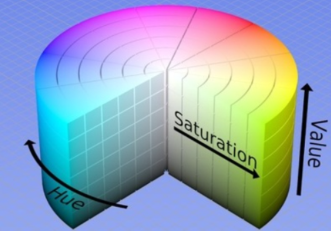
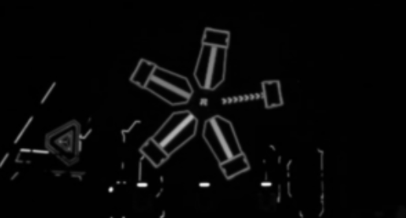
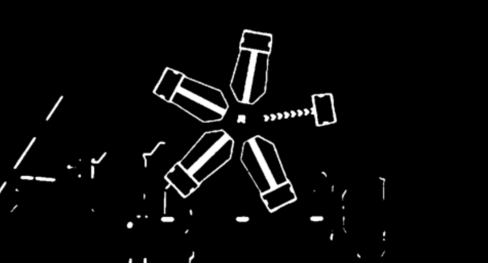
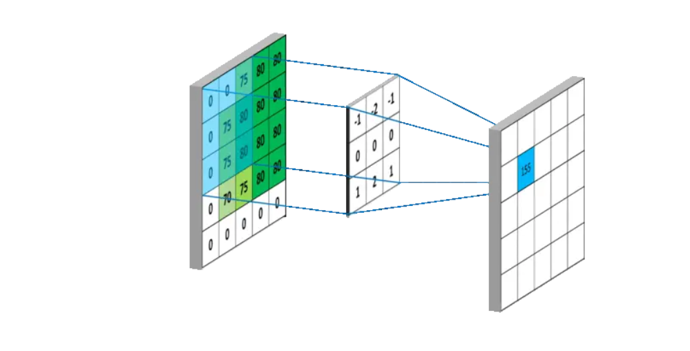
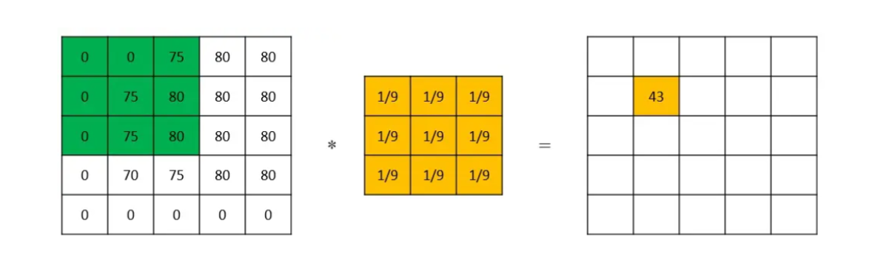
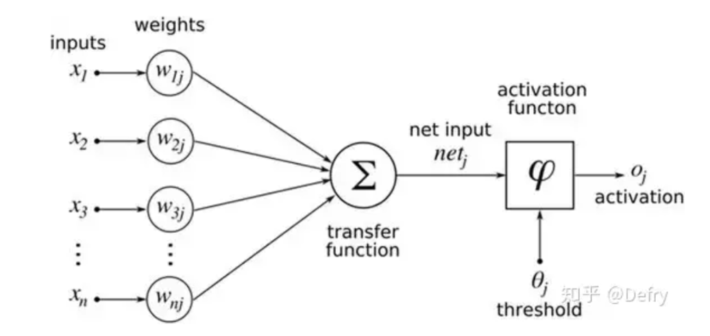
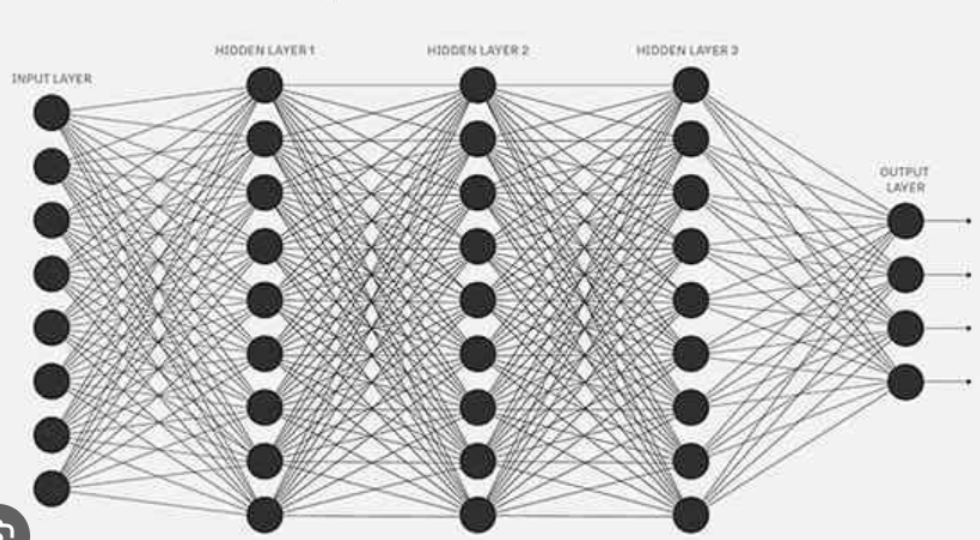

# Lecture 8

---
level: 1
layout: two-cols
---

## Introduction: 自动瞄准系统构成

  

### Part 1: 识别目标

  

### Part 2: 运动状态估计

  

### Part 3: 击打规划

---
layout: cover
---

# 数字图像处理

---
layout: two-cols-header
---

## 图像的数字表示

分辨率： 图像拥有的像素数量。一般表示方法为w * h。

- 一张横向有1920像素，纵向有1080个像素的图像，分辨率为1920 * 1080 

颜色空间：每个像素用三个8-bit数(0-255)表示, 表示此像素点的颜色信息。

- 不同的颜色空间，像素的值有不同含义。opencv提供将图像在不同颜色空间中进行转换的函数

::left::

  
- RGB颜色空间： Red，Green, Blue

- HSV颜色空间： 色相，饱和度与亮度

::right::

HSV颜色空间

---
layout: two-cols
---

## 灰度图 & 二值图

**灰度图**

每个像素点只有一个值，表示灰度值。0表示黑色，255表示白色。

- 灰度图的计算方法：
$$
Gray = 0.299 * R + 0.587 * G + 0.114 * B
$$

 
 

**二值图**

特殊的灰度图，像素点的灰度只有0和255两种情况

稍后会讨论如何将灰度图转换为二值图

::right::

  

  

---

## 卷积
  

---

### Demo: 均值滤波
  

---

## 形态学运算

- **膨胀:** 用一个结构元素在图像上滑动，如果结构元素与图像重叠的部分有一个像素是非零的，那么图像上对应的像素就是1，否则为0。

- **腐蚀:** 用一个结构元素在图像上滑动，如果结构元素与图像重叠的部分全是非零像素，那么图像上对应的像素就是1，否则为0。

- **开运算:** 先腐蚀后膨胀

- **闭运算:** 先膨胀后腐蚀

---
layout: cover
---

# Introduction to Deep Learning

---
layout: two-cols
---

## 多层感知器: 神经元

    

- 输入层：接受输入信号
- 权重： 每个输入信号的权重
- 激活函数： 将输入信号的加权和转换为输出信号

**正向传播：**

$$
output = w_1 * x_1 + w_2 * x_2 + w_3 * x_3 + w_4
$$

**反向传播：**

$$
\frac{\partial E}{\partial w_{1,j}} = \frac{\partial E}{\partial output} * \frac{\partial output}{\partial w_{1,j}}
$$

::right::

  

  

---

## 多层感知器

---

## 特征提取&卷积神经网络

---

## YOLO(You Only Look Once)

---
layout: cover
---

# Project Preview

