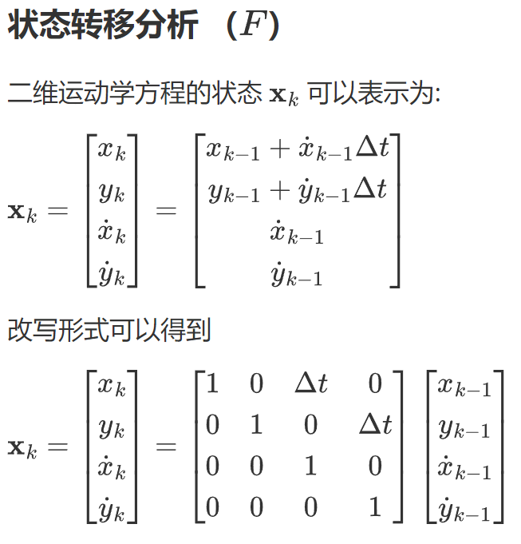
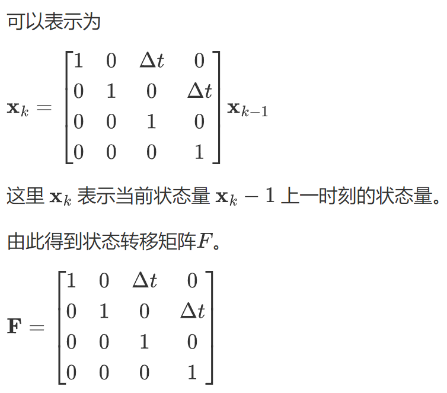

---
layout: two-cols
---
## 坐标转换实例
这里给出Robomaster比赛中更加具体的坐标变换例子。

定义坐标系如下

- $A$  装甲板坐标系（$Armor$） 
- $C$ 相机坐标系 $(Camera)$ 
- $R$ 机器人坐标系(陀螺仪坐标系) $(Robot)$

::right::
### (1)装甲板坐标系到相机坐标系
在实际的装甲板检测中，可以通过**pnp**算法得到 装甲板坐标系想对于相机坐标系的 **平移向量**$(t_{vec})$ 和 **旋转向量** $r_{vec}$ 。 

---
layout: two-cols
---
## 坐标转换实例

这里旋转向量和旋转矩阵的转换关系可以通过罗德里格斯变换实现，具体参考[OpenCV: Camera Calibration and 3D Reconstruction](https://docs.opencv.org/3.4/d9/d0c/group__calib3d.html#ga61585db663d9da06b68e70cfbf6a1eac)

于是通过pnp 可以得到 $^A_CR$ 和 $^A_Ct$，由此完成$^A_CT$ 的从**装甲板坐标系**到**相机坐标系**的变换。

::right::
### (2) 相机坐标系到机器人坐标

在实际比赛中，由于相机坐标系固定到云台上，最终还需要得到相对于机器人坐标系（或者说陀螺仪坐标系）的值，来进行更直接的运动解算。

有之前的例子，显然的是具体解算 $^C_RT$需要得到相机坐标系到机器人坐标系的**平移向量** $^C_Rt_{vec}$ 和**旋转矩阵** $^C_RR$.

其中**平移向量**即为相机安装位置（相机坐标系远点）相对于机器人转轴中心点（近似的陀螺仪坐标系原点）的**固定偏置** 。

由于当前机器人云台为二维云台，只存在$yaw, pitch$ 两个角度的旋转，因此可以由电控方面发给视觉的解算的$yaw,pitch$ 角度，进行**连续两次旋转矩阵的相乘**，来计算得到 $^C_RR$ 旋转矩阵。

注意机器人（陀螺仪）坐标系指向，$y$轴向上，$x,z$轴共平面，右手系。
---
layout: two-cols
---
## 坐标转换实例

::right::
### (3)装甲板坐标系到机器人坐标系

结合上述两个坐标系变换可以得到：
$$
^A_RT = ^A_CT \times ^C_R T 
$$
$$
^R_AT = [^A_RT]^{-1}
$$

由此得到了相对于机器人坐标系的装甲板的坐标信息
---
layout: two-cols
---
## 卡尔曼滤波
卡尔曼滤波是一种用于线性动态系统中的递归估计方法，常用于状态估计问题，例如目标跟踪、导航、传感器融合等。它通过结合系统的预测模型和噪声观测数据来估计系统的状态，并随着时间的推移逐步更新这些估计值。

卡尔曼滤波分为两个主要阶段：**预测**和**更新**。

### 基本概念

- **状态变量** ($\mathbf{x}_k$)：表示系统在时刻 $k$ 的内部状态。
- **状态转移模型** ($\mathbf{F}_k$)：描述系统状态如何从时刻 $k-1$ 变化到时刻 $k$。
::right::
$$
\mathbf{x}_k = \mathbf{F}_k \mathbf{x}_{k-1} + \mathbf{w}_k
$$

其中，$\mathbf{F}_k$ 是状态转移矩阵，表示从 $k-1$ 到 $k$ 的状态变化。$\mathbf{w}_k$ 是过程噪声，假设其均值为零，协方差为 $\mathbf{Q}_k$。

- **观测模型** ($\mathbf{H}_k$)：描述如何从状态估计得到观测值。

$$
\mathbf{z}_k = \mathbf{H}_k \mathbf{x}_k + \mathbf{v}_k
$$

其中，$\mathbf{H}_k$ 是观测矩阵，由于建立观测量和状态量之间的关系。$\mathbf{v}_k$ 是测量噪声，假设其均值为零，协方差为 $\mathbf{R}_k$。

- **噪声协方差矩阵**：
  - $\mathbf{Q}_k$：过程噪声协方差矩阵。
  - $\mathbf{R}_k$：测量噪声协方差矩阵。

- **状态协方差** ($\mathbf{P}_k$)：描述状态的不确定性

---
layout: two-cols
---

## 卡尔曼滤波
### (1)预测阶段
在预测阶段，卡尔曼滤波器根据之前的状态估计来预测当前时刻 $k$ 的状态和协方差。

**状态预测公式：**
$$
\mathbf{\hat{x}}_k^- = \mathbf{F}_k \mathbf{\hat{x}}_{k-1}
$$

- $\mathbf{\hat{x}}_k^-$ 是预测的状态估计值（先验估计）。
- $\mathbf{F}_k$ 是状态转移矩阵，表示从 $k-1$ 到 $k$ 的状态变化。
::right::
**协方差预测公式：**
$$
\mathbf{P}_k^- = \mathbf{F}_k \mathbf{P}_{k-1} \mathbf{F}_k^T + \mathbf{Q}_k
$$

- $\mathbf{P}_k^-$ 是预测的状态协方差矩阵（先验协方差）。
- $\mathbf{P}_{k-1}$ 是前一时刻状态估计的协方差矩阵。
- $\mathbf{Q}_k$ 是过程噪声的协方差。

### (2)更新阶段

在更新阶段，卡尔曼滤波器利用观测数据来修正预测的状态和协方差，从而得到更准确的估计值。

**卡尔曼增益公式**
$$
\mathbf{K}_k = \mathbf{P}_k^- \mathbf{H}_k^T \left( \mathbf{H}_k \mathbf{P}_k^- \mathbf{H}_k^T + \mathbf{R}_k \right)^{-1}
$$
- $\mathbf{K}_k$ 是卡尔曼增益矩阵，确定如何在观测值和预测状态之间加权。
---
layout: two-cols
---
## 卡尔曼滤波
### (2)更新阶段
**状态更新公式**
$$
\mathbf{\hat{x}}_k = \mathbf{\hat{x}}_k^- + \mathbf{K}_k \left( \mathbf{z}_k - \mathbf{H}_k \mathbf{\hat{x}}_k^- \right)
$$

- $\mathbf{\hat{x}}_k$ 是更新后的状态估计值（后验估计）。
- $\mathbf{z}_k - \mathbf{H}_k \mathbf{\hat{x}}_k^-$ 是预测误差，即测量值和预测观测的差值，也叫做 **残差**。

**协方差更新公式**
$$
\mathbf{P}_k = \left( \mathbf{I} - \mathbf{K}_k \mathbf{H}_k \right) \mathbf{P}_k^-
$$

- $\mathbf{P}_k$ 是更新后的状态协方差矩阵（后验协方差）。

- $\mathbf{I}$ 是单位矩阵。

::right::
### 卡尔曼滤波流程总结

1. **预测阶段**：
   - 预测状态：$\mathbf{\hat{x}}_k^- = \mathbf{F}_k \mathbf{\hat{x}}_{k-1}$
   - 预测协方差：$\mathbf{P}_k^- = \mathbf{F}_k \mathbf{P}_{k-1} \mathbf{F}_k^T + \mathbf{Q}_k$

2. **更新阶段**：
   - 计算卡尔曼增益：
   - $\mathbf{K}_k = \mathbf{P}_k^- \mathbf{H}_k^T \left( \mathbf{H}_k \mathbf{P}_k^- \mathbf{H}_k^T + \mathbf{R}_k \right)^{-1}$
   - 更新状态估计：$\mathbf{\hat{x}}_k = \mathbf{\hat{x}}_k^- + \mathbf{K}_k \left( \mathbf{z}_k - \mathbf{H}_k \mathbf{\hat{x}}_k^- \right)$
   - 更新协方差估计：$\mathbf{P}_k = \left( \mathbf{I} - \mathbf{K}_k \mathbf{H}_k \right) \mathbf{P}_k^-$

这个递归过程使得卡尔曼滤波能够在噪声环境下对系统的状态进行实时跟踪。

---
layout: two-cols
---
## 二维运动的卡尔曼滤波实例

参数定义

$k:$  当前时间 , $k-1:$ 上一阶段时间

$x,y$ :  $x$ 和 $y$ 方向的位置

$\dot{x},\dot{y}$ ：$x$ 和 $y$ 方向的速度

::right::

---
layout: two-cols
---

## 二维运动的卡尔曼滤波实例
### 观测分析 （$H$）
由前面分析的观测方程如下：

$$\mathbf{z}_k=H\mathbf{x}_k+\mathbf{v}_k$$

在推导观测模型时，我们假设我们**只测量位置**而**不测量速度**。然而，在某些情况下，速度必须考虑到多普勒效应，例如，飞机和卫星跟踪系统。我们现在考虑的是在测量过程中不考虑速度的特殊情况。

所以测量量为：

$\textbf{z}_k = \left[ \begin{matrix} x_k \\ y_k\end{matrix}\right] + \textbf{v}_k$

因此，为了建立**观测量**和**状态量**之间的联系，我们可以将测量模型写成；
::right::
$$\mathbf{z}_k=\begin{bmatrix}1&0&0&0\\0&1&0&0\end{bmatrix}\begin{bmatrix}x_k\\y_k\\\dot{x}_k\\\dot{y}_k\end{bmatrix}+\mathbf{v}_k$$

由此得到的观测矩阵为 $H$ 

$$\mathbf{H}=\begin{bmatrix}1&0&0&0\\0&1&0&0\end{bmatrix}$$
---
layout: two-cols
---

## 二维运动的卡尔曼滤波实例

### 过程噪声协方差矩阵 $Q$

假设测量位置$x$和$y$都是独立的，因此我们可以忽略它们之间的任何相互作用，使协方差$x$和$y$为0。$Q$可以表达为：

$$\begin{gathered}\quad \quad x \quad \quad y \quad \quad \quad \dot{x} \quad \quad\dot{y}\\\mathbf{Q}=\begin{array}{c}x\\y\\\dot{x}\\\dot{y}\end{array}\begin{bmatrix}\sigma_x^2&0&\sigma_x\sigma_{\dot{x}}&0\\0&\sigma_y^2&0&\sigma_y\sigma_y\\\sigma_{\dot{x}}\sigma_x&0&\sigma_{\dot{x}}^2&0\\0&\sigma_{\dot{y}}\sigma_y&0&\sigma_{\dot{y}}^2\end{bmatrix}\end{gathered}$$

可以重写为与时间相关

$$\begin{gathered}\mathbf{Q}=\begin{bmatrix}\frac{\Delta t^4}{4}&0&\frac{\Delta t^3}{2}&0\\0&\frac{\Delta t^4}{4}&0&\frac{\Delta t^3}{2}\\\frac{\Delta t^3}{2}&0&\Delta t^2&0\\0&\frac{\Delta t^3}{2}&0&\Delta t^2\end{bmatrix}\sigma_a^2\end{gathered}$$

其中$\sigma_{a}$是加速度标准偏差的大小基本上是过程噪声对过程噪声协方差的影响。

::right::
### 测量噪声协方差矩阵 $R$

同,测量噪声协方差R可表示为:

$$\begin{gathered}\quad \quad \quad x \quad  y \\\mathbf{R}=\begin{array}{c}x\\y\\\end{array}\begin{bmatrix}\sigma_x^2&0\\0&\sigma_{{y}}^2\end{bmatrix}\end{gathered}$$ 

$$\mathbf{R} = \begin{bmatrix}\frac{\Delta t^4}{4}&0\\0&\frac{\Delta t^4}{4}\end{bmatrix}$$
---
layout: two-cols
---
## 拓展卡尔曼滤波
卡尔曼滤波仅适用于**线性系统**，若是变量间关系设计到**非线性**，显然无法使用简单的矩阵运算描述变量间关系。

此时需要采用**拓展卡尔曼**进行建模，同时使用**雅可比矩阵**来描述变量间的关系，但是本质思想不变。

EKF步骤如下:

(1)状态预测：利用非线性系统的状态方程进行预测。

(2)线性化：通过在当前状态估计处对非线性方程进行一阶泰勒展开，得到线性化模型。

(3)更新：根据观测值更新状态估计和协方差矩阵。
::right::
## 主要公式

### 1.预测步骤

$$\hat{x}_k^-=f(\hat{x}_{k-1},u_{k-1})$$
$$P_k^-=F_kP_{k-1}F_k^T+Q_k$$

其中 $f$ 为状态转移函数，$F_k$ 是状态转移函数的雅可比矩阵，$P_k^{-}$ 是预测协方差矩阵，$Q_k$ 是过程噪声协方差矩阵。

### 2.更新步骤：

$$K_k=P_k^-H_k^T(H_kP_k^-H_k^T+R_k)^{-1}$$
$$\hat{x}_k=\hat{x}_k^-+K_k(z_k-h(\hat{x}_k^-))$$
$$P_k=(I-K_kH_k)P_k^-$$

其中$H_k$ 是观测方程的雅可比矩阵，$R$是测量噪声协方差矩阵,$z_k$是测量值。
---
layout: two-cols
---

## 拓展卡尔曼滤波

### 状态预测方程的线性化

对于状态转移方程$f(x):$

$$\hat{x}_k^-=f(\hat{x}_{k-1},u_{k-1})$$

它被线性化为：

$$F_k=\frac{\partial f}{\partial x}\Big|_{\hat{x}_{k-1}}$$

其中$F_k$是状态转移函数的雅可比矩阵，表示对当前状态的线性近似。
::right::
### 观测方程的线性化：

观测方程$h(x):$

$$z_k=h(x_k)+v_k$$

被线性化为：

$$H_k=\left.\frac{\partial h}{\partial x}\right|_{\hat{x}_k^-}$$

其中$H_k$是观测方程的雅可比矩阵，表示对观测模型的线性近似。
---