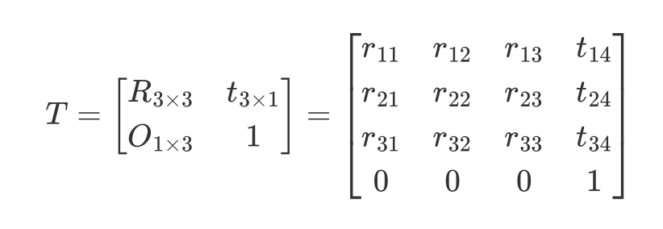

# Lecture 9
BanGVision! It's MyCode!!!!!

---

## 工业相机成像原理

---

## 重要参数

- 靶面尺寸
镜头靶面尺寸应该至少不小于传感器的尺寸。

---

## 相机标定

---

## pnp解算

---
layout: two-cols
---

## 坐标转换

### 参数定义规范

$^A_Bx$

$A$ 表示相对坐标系，$B$ 表示当前坐标系， $x$ 表示参量，这里指 $x$ 坐标。

这里表示 $B$ 坐标系相对于$A$ 坐标系的$x$ 坐标值。

对于 $^A_BT$ 这个坐标变换阵，采用矩阵左乘的计算方式，表示的是从坐标系 $A$ 到坐标系 $B$ 的坐标系变换。

三维**坐标变换阵**的通式如下：

::right::

坐标变换阵主要由 **旋转矩阵(rotation matrix)** $R$ 和 **平移向量(translation)** $t$ 组成，此外还有一部分齐次坐标。

其中**旋转矩阵** $R$ 是一个$3 \times 3$ 的正交矩阵，描述在三维空间中的旋转。旋转矩阵具有以下性质：

- **正交性**：$R^TR = I$，即矩阵的转置等于其逆。

- **行列式为 1**：$∣R∣=1$，表示旋转不改变空间的体积。

**旋转矩阵表示的是两个坐标系之间坐标轴的空间指向的旋转关系。**

---
layout: two-cols
---

## 坐标转换

常见的旋转矩阵可以通过绕坐标轴旋转的方式构造

  

- Example: 绕 $x$、$y$、$z$ 轴的旋转矩阵分别为：

::right::

  

---

## 卡尔曼滤波

---

## 拓展卡尔曼滤波