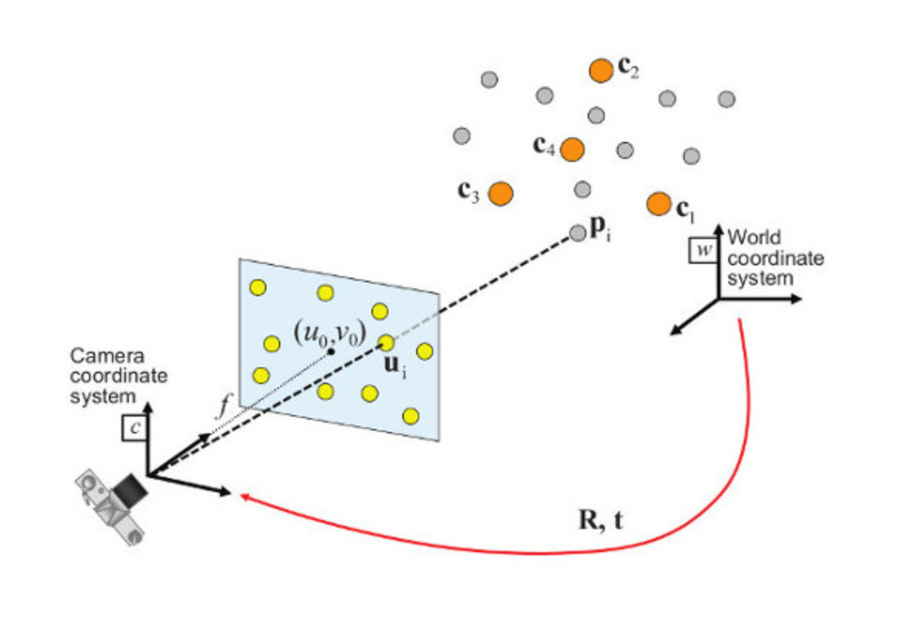
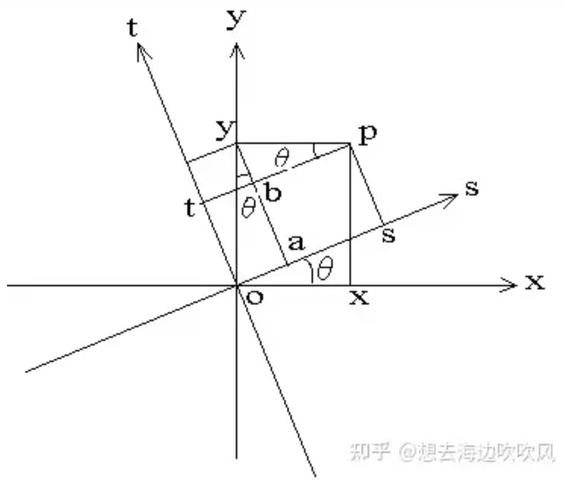
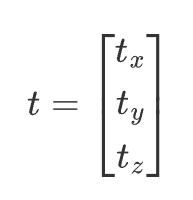
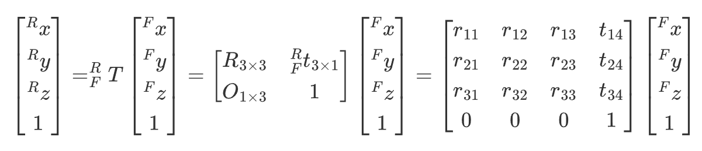

# Lecture 9
BanGVision! It's MyCode!!!!!

---

## 工业相机成像原理


---

## 重要参数

- 靶面尺寸
镜头靶面尺寸应该至少不小于传感器的尺寸。

---
---
## 相机标定
cv::calibrateCamera 是 OpenCV 中用于相机标定的函数，主要用于计算相机内参矩阵和畸变系数。
```c++
double cv::calibrateCamera(
    const std::vector<std::vector<cv::Point3f>>& objectPoints,
    const std::vector<std::vector<cv::Point2f>>& imagePoints,
    cv::Size imageSize,
    cv::Mat& cameraMatrix,
    cv::Mat& distCoeffs,
    std::vector<cv::Mat>& rvecs,
    std::vector<cv::Mat>& tvecs,
    int flags = 0,
    cv::TermCriteria criteria = cv::TermCriteria(cv::TermCriteria::EPS + cv::TermCriteria::COUNT, 30, DBL_EPSILON)
);
```
objectPoints: 3D点的集合，通常是世界坐标系中的物体点   

imagePoints: 2D点的集合，对应于图像中检测到的物体点。

imageSize: 输入图像的尺寸（宽度和高度）  

cameraMatrix: 输出参数，表示相机内参矩阵。   distCoeffs: 输出参数，表示相机的畸变系数。

rvecs: 输出参数，旋转向量（相机相对于世界坐标系的旋转）。  tvecs: 输出参数，平移向量。

flags:可选标志，控制算法的行为。criteria:终止条件，指定优化的精度和迭代次数。类型为 cv::TermCriteria
---
layout: two-cols
---
## pnp解算
pnp 算法通过建立相机像素平面上特征点的**2D信息**和实际物体对应特征点的**3D**坐标信息，完成了目标坐标系和相机坐标系之间的**位置**和**姿态**的解算

::right::

```c++
bool cv::solvePnP(
    const std::vector<cv::Point3f>& objectPoints,
    const std::vector<cv::Point2f>& imagePoints,
    const cv::Mat& cameraMatrix,
    const cv::Mat& distCoeffs,
    cv::Mat& rvec,
    cv::Mat& tvec,
    bool useExtrinsicGuess = false,
    int flags = cv::SOLVEPNP_ITERATIVE
);
```
objectPoints: 3D点的集合，表示物体在空间中的位置。

imagePoints: 对应的2D点集合，表示在图像中的位置。

cameraMatrix: 相机内参矩阵，包含焦距和主点信息。

distCoeffs: 相机畸变系数，描述镜头的畸变情况。

rvec: 输出参数，表示相机的旋转向量。

tvec: 输出参数，表示相机的平移向量。

useExtrinsicGuess: 是否使用外部猜测值。

flags: 控制算法行为的标志，默认为迭代法。
---
layout: two-cols
---

## 坐标转换

### 参数定义规范

$^A_Bx$

$A$ 表示相对坐标系，$B$ 表示当前坐标系， $x$ 表示参量，这里指 $x$ 坐标。

这里表示 $B$ 坐标系相对于$A$ 坐标系的$x$ 坐标值。

对于 $^A_BT$ 这个坐标变换阵，采用矩阵左乘的计算方式，表示的是从坐标系 $A$ 到坐标系 $B$ 的坐标系变换。

三维**坐标变换阵**的通式如下：


::right::

坐标变换阵主要由 **旋转矩阵(rotation matrix)** $R$ 和 **平移向量(translation)** $t$ 组成，此外还有一部分齐次坐标。

其中**旋转矩阵** $R$ 是一个$3 \times 3$ 的正交矩阵，描述在三维空间中的旋转。旋转矩阵具有以下性质：

- **正交性**：$R^TR = I$，即矩阵的转置等于其逆。

- **行列式为 1**：$∣R∣=1$，表示旋转不改变空间的体积。

**旋转矩阵表示的是两个坐标系之间坐标轴的空间指向的旋转关系。**

---
layout: two-cols
---

## 坐标转换

常见的旋转矩阵可以通过绕坐标轴旋转的方式构造

<br></br>

2维平面的坐标系旋转$\theta$度示例： 

::right::
- Example: 绕 $x$、$y$、$z$ 轴的三维旋转矩阵分别为：
<br></br>


---
layout: two-cols
---
## 坐标转换

平移向量 $t$  是一个 $1 \times 3$ 的列向量，表示两个坐标的坐标原点之间的平移关系。它可以表示为：

<br></br>



<br></br>
**齐次坐标** 为了将平移和旋转结合在一个统一的框架下，使用齐次坐标表示。齐次坐标的引入使得在数学上更方便地处理三维变换。齐次坐标将三维点 $(x, y, z)$ 扩展为四维点 $(x,y,z,1)$.

::right::
<br></br>
一个简单的例子如下，通过 $^R_FT$ 完成了从扇叶坐标系$F$坐标值 到 机器人坐标系$R$ 坐标值的坐标变换。
<br></br>



---
layout: two-cols
---
## 坐标转换实例
这里给出Robomaster比赛中更加具体的坐标变换例子。

定义坐标系如下

- $A$  装甲板坐标系（$Armor$） 
- $C$ 相机坐标系 $(Camera)$ 
- $R$ 机器人坐标系(陀螺仪坐标系) $(Robot)$

::right::
### (1)装甲板坐标系到相机坐标系
在实际的装甲板检测中，可以通过**pnp**算法得到 装甲板坐标系想对于相机坐标系的 **平移向量**$(t_{vec})$ 和 **旋转向量** $r_{vec}$ 。 
