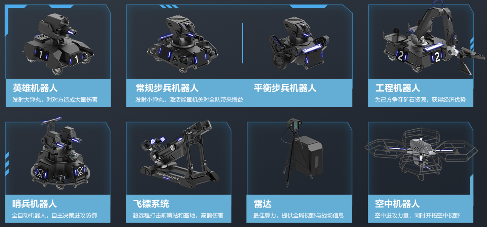
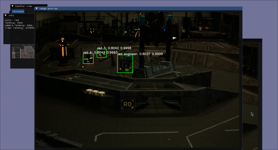
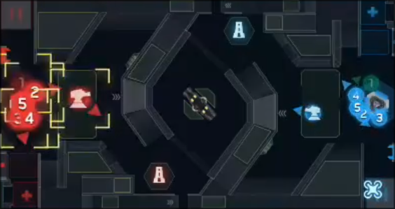

# Lecture 0

## 主讲人: 黄梓通

---
level: 1
layout: default
---

**目录**

<Toc minDepth="1" maxDepth="1"></Toc>

---
layout: cover
background: img/field.png
---

# RoboMaster赛事介绍
---
layout: two-cols-header
---

# RoboMaster赛事介绍
 

RoboMaster 机甲大师赛分为三个比赛：**1v1步兵对抗赛**, **高校联盟赛**和**超级对抗赛**。
步兵对抗赛规模较小，通常与高校联盟赛同时举行。我们主要介绍高校联盟赛与超级对抗赛。
::left::
## 高校联盟赛
- 清明节前后
- 出差3天
- 3v3平面地图对抗
::right::
## 超级对抗赛
- 分区赛（期末周前）
- 复活赛&全国赛（八月初）
- 在分区赛获得赛区前16强的队伍，将**有机会**参加复活赛。分区赛获得前8强的队伍，有资格参加全国赛。

---
layout: default
---

**RoboMaster超级对抗赛介绍**

RoboMaster 机甲大师超级对抗赛（RMUC, RoboMaster University Championship），侧重考察参赛队员对理工学科的综合应用与工程实践能力，充分融合了“机器视觉”、“嵌入式系统设计”、“机械控制”、“自主导航”、“人机交互”等众多机器人相关技术学科，同时创新性的将电竞呈现方式与机器人竞技相结合，使机器人对抗更加直观

**规则介绍**

在2024赛季中，对战双方需自主研发不同种类和功能的机器人，在指定的比赛场地内进行战术对抗，通过操控机器人发射弹丸攻击对方机器人和基地。比赛结束时，基地剩余血量高的一方获得比赛胜利。

--- 
layout: iframe
url: https://www.bilibili.com/video/BV1ai421X7U6?p=57&vd_source=8230816b827a6144796db49afdcbacaa
--- 

**比赛回放：上海交通大学 vs 广东工业大学**

---
layout: cover
---

# 视觉/算法组工作内容

--- 
layout: default
---

**自动瞄准系统**

<video width="600" controls>
  <source src="./Video/auto_aim.mp4" type="video/mp4">
  Your browser does not support the video tag.
</video>

--- 
layout: default
--- 

**能量机关激活**

<video width="800" controls>
  <source src="./Video/buff_active.mp4" type="video/mp4">
  Your browser does not support the video tag.
</video>

--- 
layout: two-cols
--- 

**雷达站**
   

**机器人识别**

::right::

   

**操作手UI**

--- 
layout: default
--- 

**导航系统**

<video width="800" controls>
  <source src="./Video/nav.mov" type="video/mp4">
  Your browser does not support the video tag.
</video>

---
layout: two-cols-header
---

# 培训安排
视觉/算法组培训安排

视觉/算法组培训为课程+项目的制度，从9月持续到11月，共计八周。课程安排为每周两天，每天1-2小时课程时间，加上每周3-5h的作业量。

前4周以授课+课后作业的形式为主，后4周以预研项目为主。

::left::
## Part 1 课程
1. linux/git 简介，环境配置（1周）
2. C/C++ 基础（2周）
3. 视觉/导航算法基础（1周）
4. 代码讲解（1周）
  

::right::
## Part 2 预研项目
- [2025赛季预研项目](https://heavy-trampoline-037.notion.site/679f70dcd4234c41bc805b2eee3b41eb?pvs=4)

